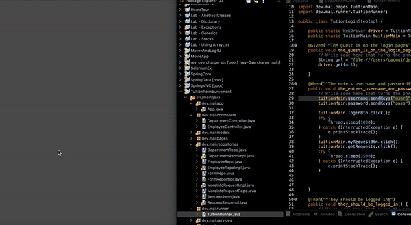

# Tution Reimbursement

## Project Description

TRMS, or Tuition Reimbursement Management System is a full-stack web application that allows employees to submit requests for reimbursements for courses, events, and certifications. 

## Technologies Used

* Java - version 8.0
* Maven - version 4.0.0
* PostgreSQL - version 42.2.20
* Hibernate - version 5.5.3
* Javalin - version 3.13.11
* Selenium - verison 3.8.1
* Cumcumber - version 1.2.4
* Log4j - version 1.2.17
* HTML/CSS
* Javascript

## Features

List of implemented features:
* Employee can initiate a reimbursement request
* An reimbursement estimate will be given to the employee to gauge if it's worth their time
* The supervisor, department head, and benefits coordinator can approve a reimbursement request
* Employee can submit a grade to prove they have completed the event
* Reimbursement requests are automatically approved if a certain amount of time has passed

To-do list:
* Frontend improvement to organize and show all pending requests and all approved requests
* Employee can add attachments to their requests to bypass some approval processes
* Register new employee and assign a role and privileges to each employee

## Getting Started
   
To clone the project:
`git clone https://github.com/caocmai/Tuition-Reimbursement`

Then to run the Java program, first build the Java project with Maven and execute the project.

Here's a [link](https://www.oracle.com/webfolder/technetwork/tutorials/obe/java/Maven_SE/Maven.html) to guide you.

## Usage

Make sure to run the server first. Then navigate to the `frontend` folder and open the `Login.html` page to log in and start using the application.

Accounts are currently created only on the backend so create an account first to use the application. 

#### Selenium and Cucumber Test
This tests filling out the tuition reimbursement form and the login functionality. 

## License

This project uses the following license: [Mit-License](LICENSE).
